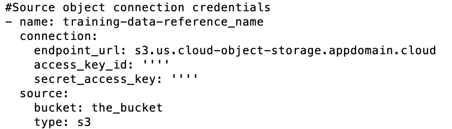
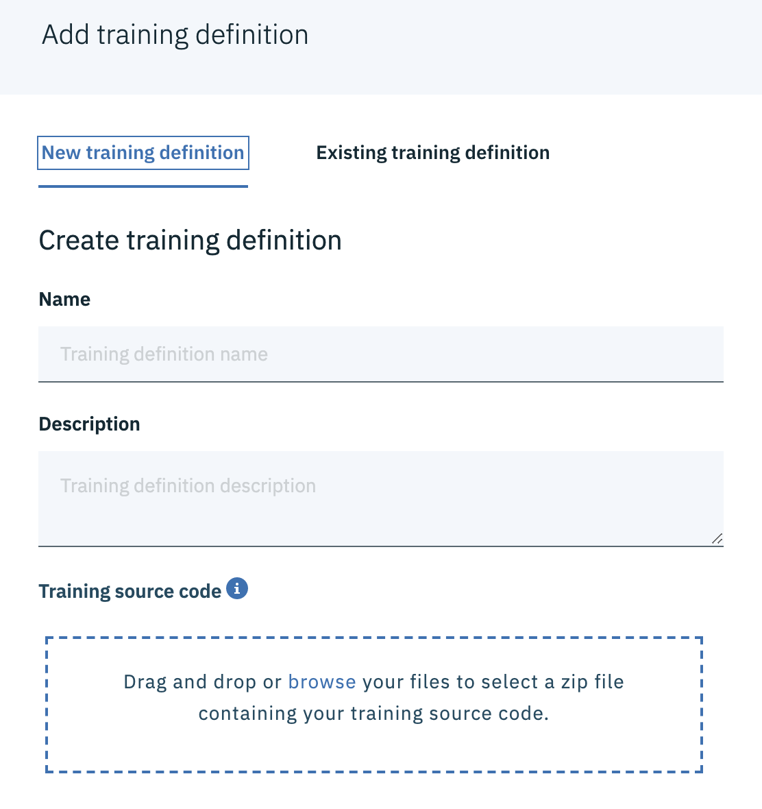

# 
Deep learning models using Watson Studio Neural Network Modeler and Experiments

## 
Build a your own training definition for the signature fraud experiment

As an addendum to the lab "[Build a model that detects signature fraud](https://github.com/IBM-DIS/workshop)" this instruction walks you through how to add your own training source code to the experiment.

If the generated training definition fails to load, use the "New training definition" and upload the zip file as the training source code.

### Step 1. Download the .zip file. 
Download the my-training.zip. Unzip the content to a directory on your computer. Open my-support-definitions.yml file for editing.

### Step 2. Locate the section called training data reference name in the .yml file. 
Add your COS credentials. You need to change the access_key_id, secret_access_key and bucket name.

### Step 3. Save the file and add it back to the zip file. 
You can use the following zip command:
<pre style="color: silver; background: black;">$ zip my-training.zip my-support-definitions.yml</pre>

### Step 4. In the add training definition dialog, add your zip file as the source code.

### Ref. [Create a Training definition](https://dataplatform.cloud.ibm.com/docs/content/wsj/analyze-data/ml_dlaas_working_with_training_definitions.html)
